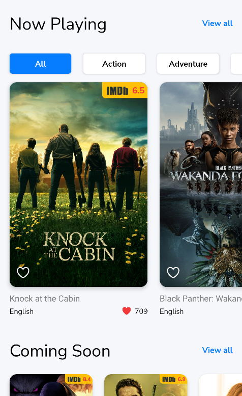
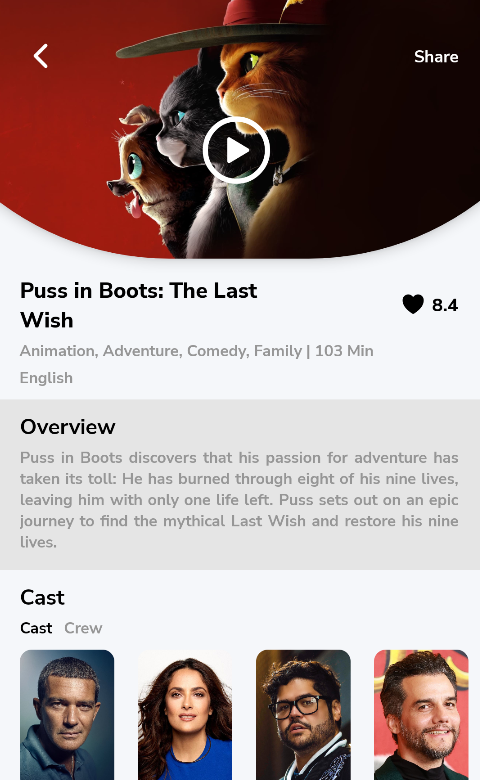

# Movies App

This API is create with [React Native (Expo)](https://expo.dev/) and [The Movie Database (TMDB)](themoviedb.org).

## How to clone

Before cloning the repository, you need to have these technologies.

* [Android Studio](https://developer.android.com/studio)
* [Node.js](https://nodejs.org/en/)
* [React Native Expo](https://expo.dev/)

## Installation

Install the projecy with npm

```bash
  git clone https://gitlab.com/gbh-candidates/victor-rosario-victorrosario1890-2023-3-1-dev-frontend-coding-challenge-movies-app.git react-native-app
```

```bash
cd react-native-app && npm install
```

Install the projecy with yarn

```bash
  git clone https://gitlab.com/gbh-candidates/victor-rosario-victorrosario1890-2023-3-1-dev-frontend-coding-challenge-movies-app.git react-native-app
```

```bash
cd react-native-app && yarn
```

## Screenshot




